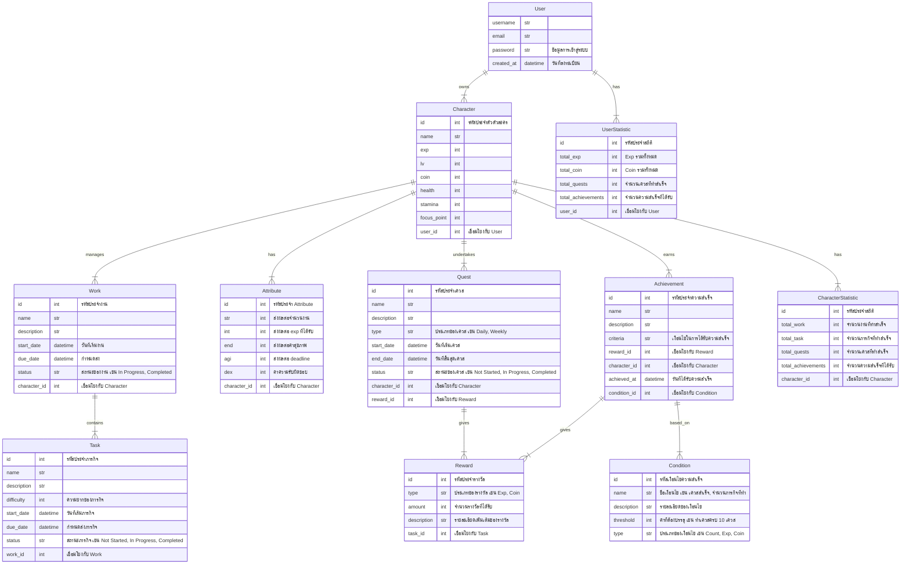

# RPG TO DO LIST

### **Requirements ของโปรเจค แอปพลิเคชัน To-Do List ผสมกับระบบ RPG**

---

#### **1. ระบบผู้ใช้ (User System)**
- **User Account:**
  - ผู้ใช้สามารถลงทะเบียนบัญชีใหม่ได้ด้วยการกรอกข้อมูลดังนี้:
    - ชื่อผู้ใช้ (username)
    - อีเมล (email)
    - รหัสผ่าน (password)
    - วันที่ลงทะเบียน (created_at) จะถูกบันทึกโดยอัตโนมัติ
  - ผู้ใช้สามารถเข้าสู่ระบบด้วยชื่อผู้ใช้หรืออีเมลและรหัสผ่านที่ลงทะเบียนไว้
  - ผู้ใช้สามารถสร้างตัวละคร (Character) ได้สูงสุด 3 ตัวละครต่อบัญชี

---

#### **2. ระบบตัวละคร (Character System)**
- **Character Creation:**
  - ผู้ใช้สามารถสร้างตัวละครได้ 3 ตัวต่อบัญชี
  - แต่ละตัวละครจะมีข้อมูลดังนี้:
    - ชื่อตัวละคร (name)
    - ค่าประสบการณ์ (exp)
    - ระดับ (level)
    - จำนวนเงินในเกม (coin)
    - ค่าพลังชีวิต (health)
    - ค่าพลังงาน (stamina)
    - ค่าจุดโฟกัส (focus_point)

- **Level Up:**
  - ตัวละครจะได้รับค่าประสบการณ์ (exp) เมื่อทำงาน (Work) หรือภารกิจ (Task) เสร็จสมบูรณ์
  - เมื่อสะสม exp ได้ถึงจำนวนที่กำหนด ตัวละครจะเลื่อนระดับ (level up) และได้รับแต้ม (point) สำหรับอัพเกรดความสามารถ (spacial)

- **Spacial System:**
  - เมื่อเลเวลตัวละครเพิ่มขึ้น ผู้ใช้จะได้รับแต้มที่สามารถนำไปอัพเกรดค่า Spacial ที่มีผลต่อการทำงานของตัวละคร
  - ค่า Spacial ที่สามารถอัพเกรดได้ ได้แก่:
    - ความแข็งแกร่ง (str) ส่งผลต่อจำนวนงานที่ทำได้
    - ความฉลาด (int) ส่งผลต่อ exp ที่ได้รับ
    - ความอดทน (end) ส่งผลต่อค่าสุขภาพ
    - ความคล่องตัว (agi) ส่งผลต่อการจัดการ deadline
    - ความรับผิดชอบ (dex) ส่งผลต่อการทำ Task

---

#### **3. ระบบงานและภารกิจ (Work and Task System)**
- **Work Management:**
  - ผู้ใช้สามารถเพิ่มงาน (Work) ได้สูงสุด 3 งานต่อหนึ่งตัวละคร
  - แต่ละงานจะมีข้อมูลดังนี้:
    - ชื่องาน (name)
    - คำอธิบายงาน (desc)
    - วันที่เริ่มงาน (start)
    - วันที่ครบกำหนดส่ง (due)

- **Task Management:**
  - ในแต่ละงานสามารถมีภารกิจย่อย (Task) ได้สูงสุด 10 ภารกิจ
  - ข้อมูลของ Task ประกอบด้วย:
    - ชื่อภารกิจ (name)
    - คำอธิบายภารกิจ (desc)
    - ระดับความยาก (difficulty)
    - วันที่เริ่มภารกิจ (start)
    - วันที่ครบกำหนดส่ง (due)
  - เมื่อ Task เสร็จสิ้น ตัวละครจะได้รับ exp และ coin ตามระดับความยากของ Task นั้น
  - เมื่อจบงาน (Work) จะได้รับ exp มากขึ้น

---

#### **4. ระบบโฟกัส (Focus Mode System)**
- **Focus Mode:**
  - ผู้ใช้สามารถเปิดใช้งานโหมดโฟกัสสำหรับการทำงานที่ต้องการความตั้งใจเป็นพิเศษ
  - ในโหมดโฟกัส ตัวละครจะใช้ค่าจุดโฟกัส (focus_point) สำหรับการทำงาน
  - การใช้ Focus Mode จะเพิ่มโอกาสในการสำเร็จงานและภารกิจในเวลาที่กำหนด

- **Focus Point:**
  - ค่าจุดโฟกัส (focus_point) สามารถได้รับจากการเลเวลอัพหรือตามเหตุการณ์พิเศษ

---

#### **5. ระบบการซื้อขายและไอเทม (Coin and Items System)**
- **Coin Earning:**
  - ผู้ใช้สามารถได้รับ Coin หลังจากเสร็จสิ้นภารกิจ (Task) และงาน (Work)
  - ปริมาณ Coin ที่ได้รับขึ้นอยู่กับระดับความยากของ Task และ Work

- **Item Purchase:**
  - ผู้ใช้สามารถใช้ Coin ที่ได้รับมาซื้อไอเทมในเกม ซึ่งจะช่วยเพิ่มประสิทธิภาพของตัวละครหรือช่วยในการทำงาน

---

#### **6. ระบบเควสประจำวัน/สัปดาห์ (Daily/Weekly Quests System)**
- **Daily/Weekly Quests:**
  - ผู้ใช้จะได้รับเควสพิเศษที่ต้องทำให้เสร็จในแต่ละวันหรือสัปดาห์
  - เควสเหล่านี้สามารถให้รางวัลพิเศษ เช่น exp, coin, หรือ item ที่มีค่ามากกว่าปกติ

---

#### **7. ระบบความสำเร็จ (Achievement System)**
- **Achievements:**
  - ผู้ใช้สามารถสะสมความสำเร็จจากการทำ Task, Work, หรือการอัพเกรดตัวละคร
  - ระบบความสำเร็จจะมีเป้าหมายหรือเงื่อนไขที่ต้องทำให้สำเร็จ เช่น "ทำ Task 100 ครั้งสำเร็จ" หรือ "เลเวลตัวละครถึงระดับ 10"
  - เมื่อบรรลุความสำเร็จ ผู้ใช้จะได้รับรางวัลพิเศษ

---

#### **8. ระบบเก็บสถิติ (Statistics System)**
- **User and Character Statistics:**
  - ระบบจะบันทึกสถิติของผู้ใช้และตัวละคร เช่น จำนวน Task ที่ทำเสร็จ จำนวนงานที่ทำสำเร็จ จำนวน exp และ coin ที่ได้รับ
  - สถิติเหล่านี้จะแสดงให้ผู้ใช้เห็นเพื่อให้ทราบภาพรวมของความก้าวหน้าในระบบ

---

### **การพัฒนาแอปพลิเคชัน**
- **Backend:**
  - ใช้ Express.js และ TypeScript สำหรับพัฒนา API และ Business Logic ทั้งหมด
- **Frontend:**
  - ใช้ SwiftUI สำหรับการพัฒนา UI/UX ที่รองรับการทำงานทั้งหมดของระบบ

### **ความคาดหวังของระบบ**
- ผู้ใช้จะสามารถจัดการการทำงานในชีวิตประจำวันได้อย่างมีประสิทธิภาพผ่านการทำงานในรูปแบบเกม RPG
- ระบบจะช่วยเพิ่มความสนุกและแรงจูงใจให้กับผู้ใช้ในการทำงานและบรรลุเป้าหมายที่ตั้งไว้

---
### **ERD**

